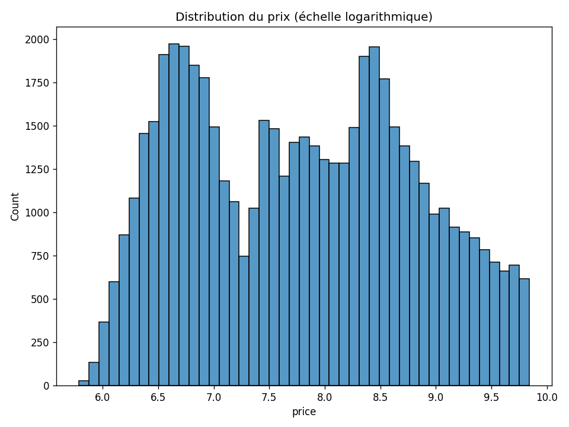
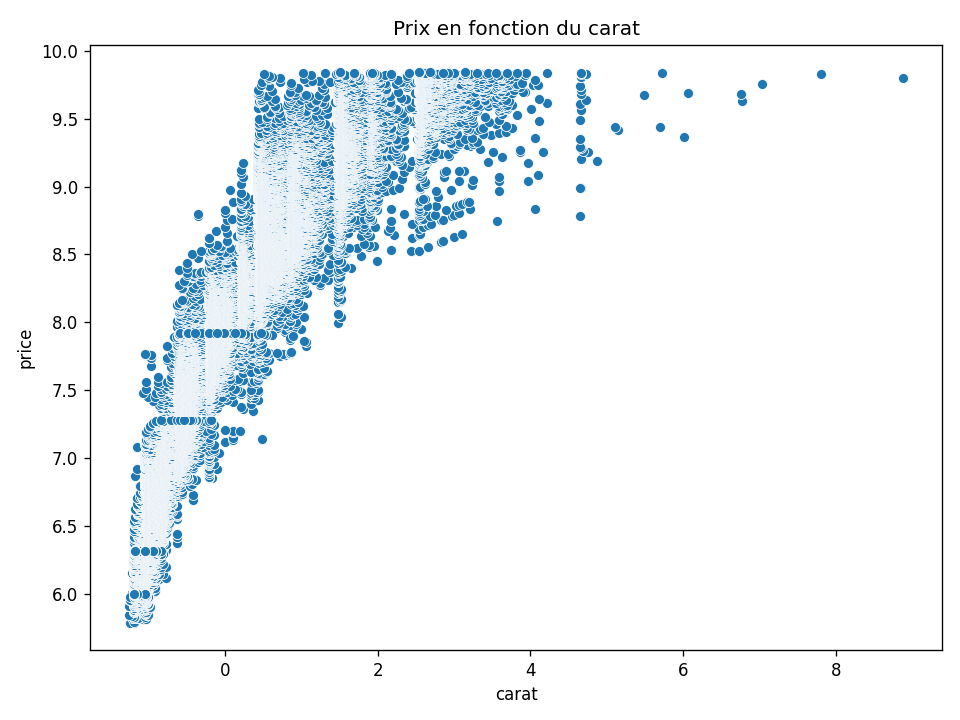
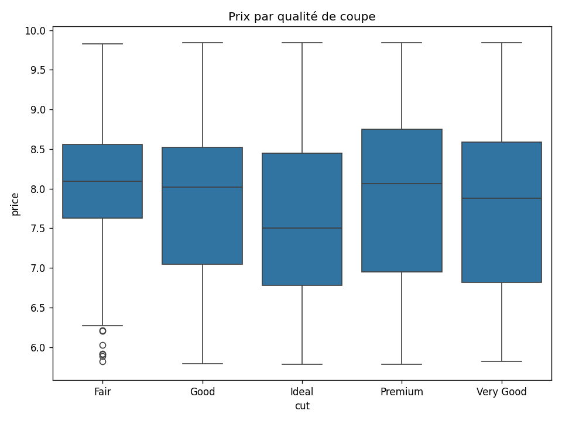
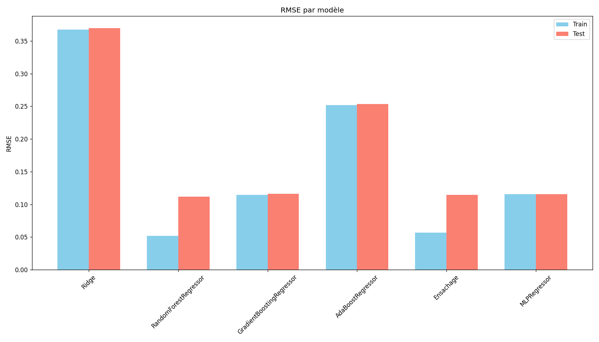

# Diamond Price Prediction

Pipeline complet de science des données pour prédire le prix de diamants à partir
de leurs caractéristiques (carat, coupe, couleur, clarté, dimensions) : nettoyage,
feature engineering, visualisation et comparaison de 6 modèles de régression
(`scikit-learn`).

## Aperçu

| Distribution des prix | Prix vs carat |
|---|---|
|  |  |

| Prix par qualité de coupe | Comparaison des modèles |
|---|---|
|  |  |


## Résultats : comparaison des modèles

RMSE (racine de l'erreur quadratique moyenne) sur le prix en échelle logarithmique,
53 940 diamants, split train/test 80/20 :

| Modèle | RMSE Train | RMSE Test |
|---|---|---|
| Ridge | 0.368 | 0.369 |
| **RandomForestRegressor** | 0.052 | **0.111** |
| GradientBoostingRegressor | 0.114 | 0.116 |
| AdaBoostRegressor | 0.249 | 0.251 |
| Ensachage (Bagging) | 0.057 | 0.115 |
| MLPRegressor | 0.111 | 0.115 |

Random Forest obtient la meilleure performance en test, suivie
de près par le Gradient Boosting, l'ensachage et le réseau de neurones. Le modèle
linéaire (Ridge) sous-performe nettement, signe que la relation entre les
caractéristiques et le prix n'est pas purement linéaire.

## Fonctionnalités

- Chargement et inspection d'un jeu de données de ~54 000 diamants (`pandas`).
- Prétraitement : encodage des variables catégoriques (`cut`, `color`, `clarity`),
  suppression des colonnes redondantes fortement corrélées (`x`, `y`, `z`),
  transformation logarithmique du prix, normalisation (`StandardScaler`).
- Feature engineering : ajout d'une caractéristique `volume` (carat × depth × table).
- Visualisations avec `seaborn`/`matplotlib` : distribution des prix, relation
  carat/prix, prix par qualité de coupe.
- Entraînement et comparaison de 6 modèles de régression : Ridge, Random Forest,
  Gradient Boosting, AdaBoost, Bagging, réseau de neurones (MLP), évalués avec le
  RMSE sur un ensemble d'entraînement et de test.

## Installation

```bash
pip install -r requirements.txt
```

## Utilisation

```bash
jupyter notebook notebook/diamond_price_prediction.ipynb
```

Exécuter les cellules dans l'ordre. Les figures sont automatiquement sauvegardées
dans le dossier `images/`.

## Structure du projet

```
diamond-price-prediction/
├── notebook/
│   └── diamond_price_prediction.ipynb
├── data/
│   └── diamonds.csv
├── images/
│   └── ... (figures générées)
├── requirements.txt
└── README.md
```

## Source des données

Jeu de données [Diamonds](https://www.kaggle.com/datasets/shivam2503/diamonds) (Kaggle).

## Contexte

Projet réalisé à Polytechnique de Montréal dans le cadre du cours INF0102 (Introduction à la programmation
pour l'ingénieur), portant sur la manipulation
de données structurées avec `pandas` et l'entraînement de modèles de régression
avec `scikit-learn`.

## Licence

[MIT](LICENSE)
